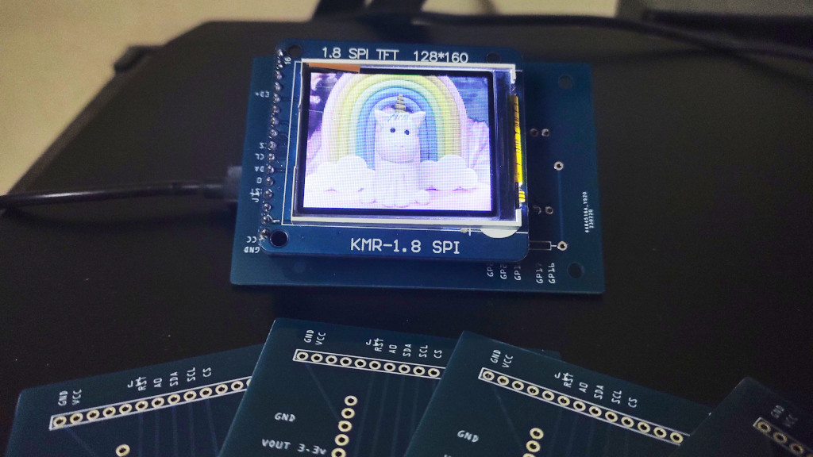
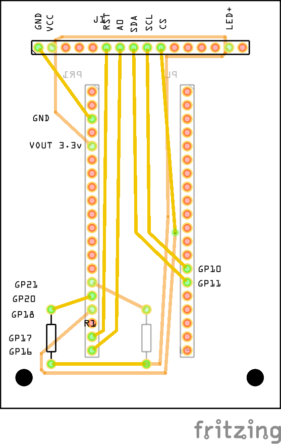
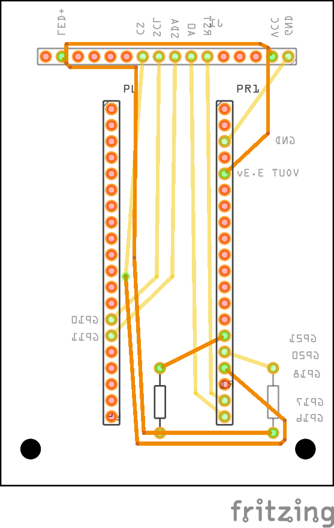

# Pi Pico Desk Display
This repository contains PCB schematics for creating a small desk display using Raspberry Pi Pico and  1.8 inch  SPI TFT LCD.

* [Fritzing Project](pi_pico_tft_display_pcb.fzz)
* [Gerber Files](gerber_files/)

## Images

