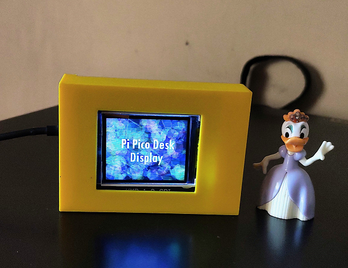

# Pi Pico Desk Display

This repository contains PCB schematics for creating a small desk display using Raspberry Pi Pico and  1.8 inch  SPI TFT LCD. 

* PCB Schematics : [Fritzing Project](pi_pico_tft_display_pcb.fzz ) and  [Gerber Files](gerber_files/)
* Case Design : [STL files for printing the case](desk_display_case.stl) and [Link to Tinkercad project](https://www.tinkercad.com/things/2sQCRFoyv3b)

|⚠️Please note that fabricating the PCB and the case should only be done by those with sufficient expertise to verify and adjust the design as necessary. The PCB schematics and 3D designs are provided for your personal use and responsibility. I cannot be held accountable for any unexpected issues or damages that may arise from their use.|
|--------------------------------------------------|

For information on assembling the project, please visit : https://ashishware.com/2023/03/17/pipico_desk_display/
## License (for schematics and artwork)

© 2023 Ashish Patil

This work is licensed under a [Creative Commons Attribution 4.0 International License](https://creativecommons.org/licenses/by/4.0/).

You are free to:

- Share — copy and redistribute the material in any medium or format
- Adapt — remix, transform, and build upon the material
  for any purpose, even commercially.

Under the following terms:

- Attribution — You must give appropriate credit, provide a link to the license, and indicate if changes were made. You may do so in any reasonable manner, but not in any way that suggests the licensor endorses you or your use.
- No additional restrictions — You may not apply legal terms or technological measures that legally restrict others from doing anything the license permits.

For more information, please refer to the [Creative Commons website](https://creativecommons.org/licenses/by/4.0/legalcode).

## Images

 
Fabricated PCB

 
Final Product (Back side)

